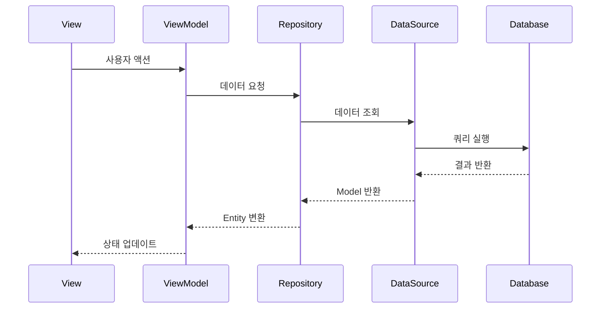

# Flutter BoilerPlate Template Guide

> 이 템플릿의 구조, 아키텍처, 개발 패턴에 대한 설명

---

## 목차

1. [Architecture](#architecture) - Clean Architecture 구조
2. [Development Patterns](#development-patterns) - 개발 패턴
3. [Feature Structure](#feature-structure) - Feature 모듈 구조
4. [State Management](#state-management) - 상태 관리
5. [Data Layer](#data-layer) - 데이터 레이어
6. [Design System](#design-system) - 디자인 시스템
7. [Automation](#automation) - 자동화 도구

---

# Architecture

## Clean Architecture 구조

### 레이어 구조
```
app/lib/
├── config/              # 앱 설정
│   ├── app_config.dart           # 앱 기본 정보
│   └── app_feature_config.dart   # 기능 플래그 (30+개)
│
├── core/                # 핵심 공통 모듈
│   ├── design/          # 디자인 시스템 (테마, 색상, 타이포)
│   ├── responsive/      # 반응형 레이아웃 (브레이크포인트, 빌더)
│   ├── router.dart      # GoRouter 라우팅 (단일 파일)
│   ├── services/        # 공통 서비스 (Firebase, Ad 등)
│   ├── state/           # 전역 상태 (app_state.dart)
│   ├── utils/           # 유틸리티
│   └── widgets/         # 공통 위젯
│
├── data/                # 데이터 레이어
│   ├── datasources/     # 로컬/원격 데이터소스
│   │   └── local/database/  # Drift 데이터베이스
│   ├── definitions/     # 테이블 정의 (Drift)
│   └── generated/       # 생성된 코드 (drift, models, repositories)
│
└── features/            # 기능별 모듈
    ├── auth/            # 인증
    ├── home/            # 홈 화면
    ├── settings/        # 설정
    └── [feature]/       # 새 기능
        ├── models/          # Freezed 모델
        ├── view_models/     # Riverpod 상태 관리
        ├── views/           # UI 화면
        └── widgets/         # 기능별 위젯
```

### 의존성 규칙

```
┌─────────────────────────────────────────────┐
│              features/ (Presentation)        │
│  - Views, ViewModels, Widgets               │
└──────────────────────┬──────────────────────┘
                       │ 사용
                       ▼
┌─────────────────────────────────────────────┐
│              core/ (Domain/Service)          │
│  - Services, State, Router                  │
└──────────────────────┬──────────────────────┘
                       │ 사용
                       ▼
┌─────────────────────────────────────────────┐
│              data/ (Data)                    │
│  - Repositories, Models, Database          │
└─────────────────────────────────────────────┘
```

**안쪽 레이어는 바깥쪽 레이어를 알지 못합니다.**

| From | To | 허용 |
|------|-----|------|
| View | ViewModel | O |
| ViewModel | Repository/Service | O |
| Repository Impl | DataSource | O |
| Domain | Data | X |
| Domain | Presentation | X |

### 데이터 흐름



---

# Development Patterns

## Feature CLI로 스캐폴딩 생성

```bash
# 기본 구조 (view만)
./feature generate -n [feature_name]

# 전체 구조 (model, viewmodel, widgets 포함)
./feature generate -n [feature_name] --full

# 선택적 생성
./feature generate -n [feature_name] --with-model --with-viewmodel
```

## 코드 생성 워크플로우

```bash
# 모델 또는 테이블 변경 후 반드시 실행
cd app
./build.sh
```

이 스크립트는 다음을 수행합니다:
1. Freezed 코드 생성 (모델)
2. Riverpod 코드 생성 (ViewModel)
3. Drift 코드 생성 (데이터베이스)
4. 생성된 파일 정리 및 이동
5. database.dart 자동 동기화

---

# Feature Structure

## 표준 Feature 구조

```
lib/features/[feature_name]/
├── models/
│   └── [feature_name]_model.dart   # Freezed 모델
├── view_models/
│   └── [feature_name]_view_model.dart  # Riverpod
├── views/
│   └── [feature_name]_view.dart    # UI
├── widgets/                         # (선택) 전용 위젯
└── index.dart                       # Public exports
```

## 예시: Profile Feature

```dart
// models/profile_model.dart
@freezed
class ProfileModel with _$ProfileModel {
  const factory ProfileModel({
    required String id,
    required String name,
    String? avatarUrl,
  }) = _ProfileModel;

  factory ProfileModel.fromJson(Map<String, dynamic> json) =>
      _$ProfileModelFromJson(json);
}

// view_models/profile_view_model.dart (수동 Notifier — @riverpod 미사용)
final profileViewModelProvider =
    NotifierProvider<ProfileViewModel, ProfileState>(ProfileViewModel.new);

class ProfileViewModel extends Notifier<ProfileState> {
  @override
  ProfileState build() => const ProfileState();

  Future<void> loadProfile() async {
    state = state.copyWith(isLoading: true);
    // 로직...
    state = state.copyWith(isLoading: false, profile: data);
  }
}

// views/profile_view.dart
class ProfileView extends ConsumerWidget {
  @override
  Widget build(BuildContext context, WidgetRef ref) {
    final state = ref.watch(profileViewModelProvider);
    final vm = ref.read(profileViewModelProvider.notifier);

    return Scaffold(
      body: state.isLoading
          ? const LoadingWidget()
          : ProfileContent(profile: state.profile),
    );
  }
}
```

---

# State Management

## Riverpod 패턴

> 이 템플릿은 Riverpod 코드 생성(`@riverpod`)을 쓰지 않는다. 수동
> `Notifier`/`NotifierProvider`로 작성한다(`.g.dart` 파트 없음).

### ViewModel 구조

```dart
final featureViewModelProvider =
    NotifierProvider<FeatureViewModel, FeatureState>(FeatureViewModel.new);

class FeatureViewModel extends Notifier<FeatureState> {
  @override
  FeatureState build() {
    // 초기 상태 반환
    return const FeatureState();
  }

  // 상태 변경 메서드들
  Future<void> loadData() async {
    state = state.copyWith(isLoading: true);
    try {
      final data = await ref.read(repositoryProvider).getData();
      state = state.copyWith(data: data, isLoading: false);
    } catch (e) {
      state = state.copyWith(error: e.toString(), isLoading: false);
    }
  }
}
```

### State 구조

```dart
@freezed
class FeatureState with _$FeatureState {
  const factory FeatureState({
    @Default(false) bool isLoading,
    String? error,
    List<Item>? items,
  }) = _FeatureState;
}
```

### View에서 사용

```dart
// 상태 구독 (리빌드 발생)
final state = ref.watch(featureViewModelProvider);

// 메서드 호출 (리빌드 없음)
final vm = ref.read(featureViewModelProvider.notifier);
vm.loadData();
```

---

# Data Layer

## Drift 테이블 정의

```dart
// lib/data/definitions/[name].dart
class [Name]Table extends Table {
  TextColumn get id => text()();
  TextColumn get title => text()();
  BoolColumn get isActive => boolean().withDefault(const Constant(false))();
  DateTimeColumn get createdAt => dateTime().withDefault(currentDateAndTime)();

  @override
  Set<Column> get primaryKey => {id};
}
```

테이블 추가 후 `./build.sh` 실행하면:
- `lib/data/generated/drift/` - Drift 코드 생성
- `lib/data/generated/models/` - Freezed 모델 생성
- `lib/data/generated/repositories/` - Repository 생성
- `database.dart` - 자동으로 테이블 등록

## Repository 패턴

```dart
// 자동 생성된 Repository 사용
final repository = ref.read([name]RepositoryProvider);

// CRUD 작업
await repository.insert(model);
final items = await repository.getAll();
await repository.update(model);
await repository.delete(id);
```

---

# Design System

## 테마 구조

```
lib/core/design/
├── design_system.dart           # 추상 인터페이스 (DesignColors/Spacing/Typography)
├── design_system_provider.dart  # 디자인 시스템 선택 Provider
├── design_context.dart          # BuildContext 확장 (context.colors 등)
├── design.dart                  # Barrel export
├── material3/                   # Material 3 구현체
└── bold_minimalism/             # Bold Minimalism 구현체
```

## 커스터마이징

```dart
// material3/material3_colors.dart — 색상 커스터마이징
class Material3Colors implements DesignColors {
  @override
  Color get primary => const Color(0xFF2196F3);

  @override
  Color get secondary => const Color(0xFF4CAF50);
  // ...
}

// material3/material3_typography.dart — 타이포그래피 커스터마이징
class Material3Typography implements DesignTypography {
  @override
  TextStyle get headlineLarge => TextStyle(
        fontFamily: fontFamily,
        fontSize: 32,
        fontWeight: FontWeight.w400,
      );
  // ...
}
```

---

# Automation

## 도구 구조

```
tools/
├── cli/                 # 핵심 Dart CLI (init, setup, rename, build, deploy 등)
│   ├── bin/             # 실행 스크립트
│   └── lib/
│       ├── commands/    # 명령어 구현
│       └── core/        # 공통 모듈 (로거, Fastlane 출력 파서)
│
└── feature_cli/         # Feature CLI (기능 관리, 스캐폴딩)
    └── bin/feature.dart

scripts/                 # Shell 래퍼 스크립트 (루트 ./deploy, ./feature 등이 위임 호출)

fastlane/                # 빌드/배포 자동화
├── Fastfile
└── fastfiles/
    ├── library/         # 재사용 함수 (primitives)
    └── stage/           # 워크플로우 단계 (orchestration)
```

## Feature CLI 명령어

```bash
./feature status              # 현재 기능 상태
./feature list                # 사용 가능한 기능 목록
./feature enable [기능명]      # 기능 활성화
./feature disable [기능명]     # 기능 비활성화
./feature generate -n [이름]   # Feature 스캐폴딩 생성
```

## 기능 플래그 시스템

`lib/config/app_feature_config.dart`:

```dart
class AppFeatureConfig {
  // 인증
  static bool isAuthenticationEnabled = true;
  static bool isBiometricAuthEnabled = true;

  // 외부 서비스
  static bool isFirebaseEnabled = true;

  // 수익화
  static bool isAdsEnabled = false;
  static bool isSubscriptionEnabled = false;

  // 기능
  static bool isOnboardingEnabled = true;
  static bool isNotificationEnabled = false;
}
```

---

## 참고 문서

- [02-SPRINT-CHECKLIST.md](../02-SPRINT-CHECKLIST.md) - 메인 가이드
- [FEATURE_MANAGEMENT.md](./FEATURE_MANAGEMENT.md) - 기능 관리
- [FASTLANE_SETUP.md](./FASTLANE_SETUP.md) - 배포 자동화
- [EXTERNAL_SETUP.md](./EXTERNAL_SETUP.md) - 외부 서비스 설정
